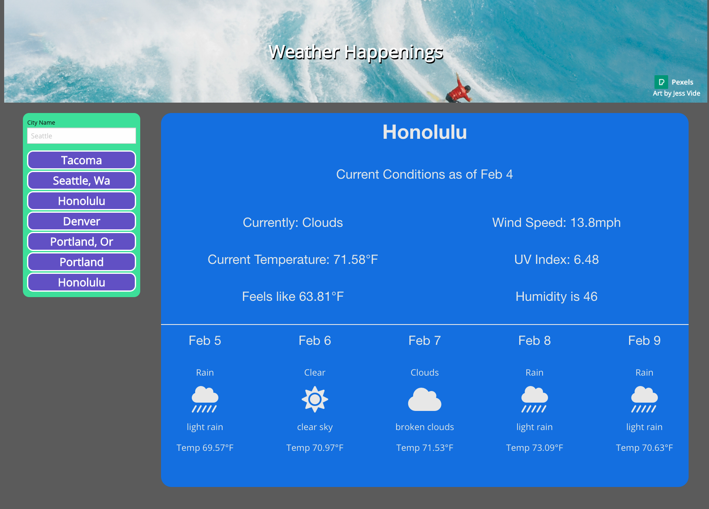

# Weather API

## Traveling with Weather
We all understand how important it is to keep track of the weather while traveling. Nothing is worse than being unprepared for a downpour when expecting sunny paradise.

This app has been built around traveling in the U.S. so is focused on primarily providing information from there.

## Workflow of the Application
1. The default city the page loads is Seattle. Once the page loads, you can type and enter the desination you would like on the left.

2. Underneath the search field there is a stored history of what you have searched for. If you would like to revisit a location, just click to return.

### Screenshot of the Application

### Thank you so very much!
I am grateful for the opportunity to be able to utilize my skills to help create something that will further assist you in your travels!

Feel free to reach out with any questions, comments or concerns that you may have.

## Link to Application

http://aereisdin.github.io/weather-api